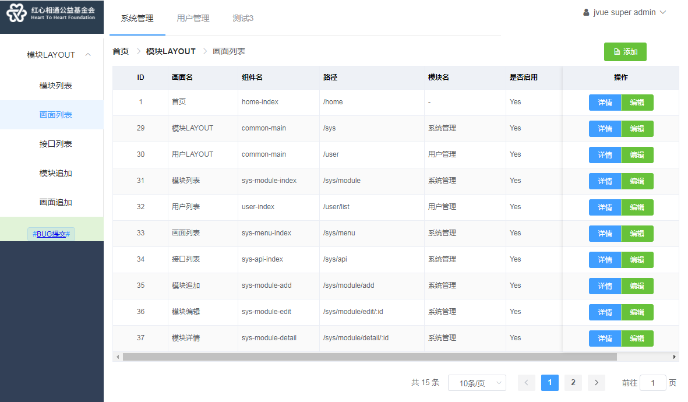

## 索引
- [概述](#概述)
- [vue.js动态路由](#vue.js动态路由)
- [模块切换](#模块切换)
- [处理浏览器刷新](#处理浏览器刷新)
- [有选择的生成菜单](#有选择的生成菜单)
- [项目完成进度](#项目完成进度)
## 概述
传统的后台系统，直接根据用户的权限，于服务器端生成不同的html画面，呈现给用户。前后端分离项目中，画面大多数情况下于用户浏览器完成渲染，即用户在登录前，客户端即获取了完整的可用于用户操作的画面代码。
这时，如果想根据用户的权限来处理菜单或画面元素的呈现，有两种方式来处理：
* 在用户登录后，使用自定义指令，把用户无权处理的菜单或项目从画面上remove掉
* 根据权限动态处理路由和菜单，并结合自定义指令，处理画面元素的呈现
下面结合vue.js的动态路由，来说明一下如何来管理权限及菜单甚至接口。其中代码开源至（未完）[jvue-admin][1]

下图为实现效果：
* 不同的业务模块，菜单不一样，避免单个模块菜单过长，另外授权时，根据模块处理权限更方便
* 画面用element-ui
* 使用了vuet代替vuex做数据的持久化



## vue.js动态路由
vue.js路由需要的几个属性：path,name,component,children,meta。动态路由需要服务器端提供这些数据，所以需要在用户登录成功后，由接口返回类似的数据。如：
```json
[{
  "id": 30,
  "component": "common-main",
  "enabled": 1,
  "iconClass": null,
  "moduleId": 2,
  "name": "用户LAYOUT",
  "path": "/user",
  "type": 1,
  "showNav": 1,
  "parentId": null,
  "children": [
    {
      "id": 32,
      "component": "user-index",
      "enabled": 1,
      "iconClass": null,
      "moduleId": 2,
      "name": "用户列表",
      "path": "/user/list",
      "type": 1,
      "showNav": 1,
      "parentId": 30,
      "children": []
    }
  ]
},
{
  "id": 42,
  "component": "common-main",
  "enabled": 1,
  "iconClass": null,
  "moduleId": 10,
  "name": "测试L",
  "path": "/test",
  "type": 2,
  "showNav": 1,
  "parentId": null,
  "children": [
    {
      "id": 43,
      "component": "test-ll",
      "enabled": 1,
      "iconClass": null,
      "moduleId": 10,
      "name": "测试LL",
      "path": "/test/ll",
      "type": 1,
      "showNav": 1,
      "parentId": 42,
      "children": []
    }
  ]
}]

```
然后在用户登录后：
转换为vue.js可识别的路由对象后追加后vue路由`$router.addRoutes(userRouters)`
处理上述menu数据至vue.js路由的方法：
```javascript 详见/src/common/utility.js
toRoutes (menus) {
    let userRouters = []
    menus.forEach(menu => {
      let {
        id,
        moduleId,
        path,
        component,
        name,
        meta = {},
        iconCls,
        children,
        showNav
      } = menu
      if (children && children instanceof Array) {
        children = utils.toRoutes(children)
      }
      meta.moduleId = moduleId
      meta.id = id
      meta.name = name
      meta.showNav = showNav

      let userRouter = {
        path: path,
        component (resolve) {
          let vfile = component.replace(/(-)/g, (v) => '/')
          require(['@/pages/' + vfile + '.vue'], resolve)
        },
        name: name,
        iconCls: iconCls,
        meta: meta,
        children: children
      }
      userRouters.push(userRouter)
    })
    return userRouters
  }
```
需要注意的是，每个父画面对应的vue文件，需要<router-view></router-view>来渲染子画面，这个在做画面管理时，可以做相应的标识。

## 模块切换
模块列表放置于顶部导航，在点击模块名时，调用changeModule处理。同样，在处理页面切换时，在全局路由钩子，也需要判断跳转前后的moduleId是否一致，以使跨模块的页面跳转后，对应的导航能正常处理。
```javascript
// 详见/src/vuet/modules/user.js
async changeModule (moduleId = 0) {
if (this.moduleId !== moduleId) {
  this.moduleId = moduleId
  this.leftRoutes = []
  this.openeds = []
  // 只需要处理第一层，第二层
  this.routers.forEach(router => {
    if (router.meta && router.meta.moduleId === moduleId && router.meta.showNav === 1) {
      // console.info(`router.meta.showNav = ${router.meta.showNav}`)
      let nrouter = Object.assign(router)
      if (nrouter.children) {
        this.openeds.push(router.path)
        nrouter.children = nrouter.children.filter((r) => r.meta && r.meta.showNav === 1)
      }
      this.leftRoutes.push(nrouter)
    } else {
      return
    }
  })
  //  FIXME 处理模块后，需要切换到对应的页面
}
},

```

## 处理浏览器刷新
vuet支持store模式的规则，来持久化用户登录数据及前端的路由和菜单数据，这里保存到`vuet#user-self`，暂时部分细节尚待处理（如：直接URL访问或刷新时登录超时的验证，敏感数据如密码等加密(或不保存)处理）。
用户刷新浏览器后，依赖vuet依然可以得到之前保存过的menus和路由等信息，但动态路由需要重新生成并调用`$router.addRoutes(userRouters)`追加至vue，这一部分处理，详见/src/vuet/modules/user.js

在刷新时，会执行到router.onReady，从本地的localstorage里取路由元(后台返回的用于创建路由的数据)数据，生成动态路由。
```javascript
// /src/router/index.js
router.onReady(() => {
  // 处理刷新后，router重加载
  let userSelf = vuet.getModule('user-self')
  if (userSelf && userSelf.user) {
    userSelf.reloadRouters()
  }
})
```

```javascript
// /src/vuet/modules/user.js
  reloadRouters () {
    if (this.menus && this.menus.length > 0) {
      let userRoutes = utils.toRoutes(this.menus)
      // 追加404
      userRoutes.push({
        path: '*',
        meta: {auth: false},
        hidden: true,
        redirect: {path: '/error/404'}
      })
      this.app.$router.addRoutes(userRoutes)
    }
  }
```

## 有选择的生成菜单
因为一些编译或详情画面，需要根据用户点击来获取ID参数，如果直接放到菜单里也无法使用，这里在后台的API里，通过返回showNav来区分，即动态生成vue.js路由，但不生成菜单。暂时在模块下，支持两层菜单，如果更多的话，稍加修改即可支持。
```html
<el-menu :default-active="String(userSelf.active)" router theme="dark" @open="handleOpen" @close="handleClose" :default-openeds="userSelf.openeds">
  <template v-for="router in userSelf.leftRoutes">
    <el-submenu :index="router.path" :key="router.path"
                v-if="router.children && router.children instanceof Array && router.children.length > 0">
      <template slot="title">{{router.name}}</template>
      <el-menu-item v-for="child in router.children" :key="child.name" :index="child.path">{{child.meta.name}}
      </el-menu-item>
    </el-submenu>
    <el-menu-item :index="router.path" :key="router.path" v-else>{{router.meta.name}}</el-menu-item>
  </template>
</el-menu>
```

## 项目完成进度
上述只是简单描述了前端的部分处理，另外配合前端后台API也开发了部分接口。后台使用的是Spring boot基本上配置下数据库就可以执行起来，有时间的话，另起一篇再说。

模块和菜单的前后端管理基本上是完成了，API的描述信息后台已有相应的机制自动收集。后续陆续追加角色，和角色与API和画面的管理(授权)，及后端API的权限拦截。

更多其他功能，如后台的权限发生变更，即时影响客户端菜单或画面重新渲染的处理可能需要下一个版本引入websocket后来实现。另外后端会使用hazelcast，以角色为单位把API/菜单权限缓存至内存中，避免每个用户加载相同的角色数据，占用比较多的内存资源和DB-IO，也解决方便授权相关数据更新后的前端响应问题。


  [1]: https://github.com/ccfish86/jvue-admin